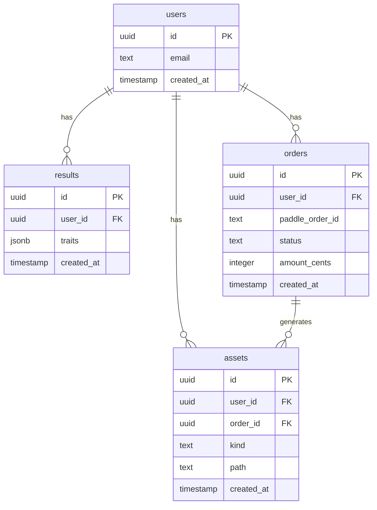

# 09 · Data Model & ERD

## Indexes
- users.email unique
- results.user_id, orders.user_id
- assets.order_id + assets.kind unique

## RLS/ACL (if Supabase)
- results: owner read; orders: owner read.
- Limitation: owner-read RLS policies require Supabase Auth, which the MVP does not use. For now, access is enforced server-side only with the service role key.
