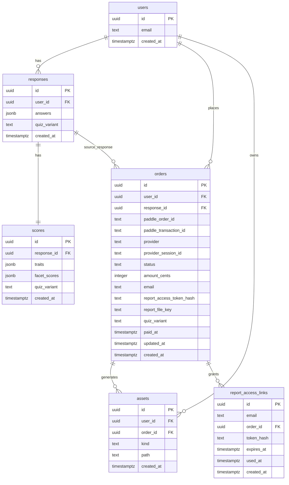

# 09 · Data Model & ERD

Current schema is defined by `supabase/migrations/*.sql`, with `quiz_variant` support added in `0015_add_quiz_variant.sql` and facet scores added in `0014_add_facet_scores.sql`.

## Important constraints
- `responses.quiz_variant`, `scores.quiz_variant`, `orders.quiz_variant` are constrained to `ipip120 | ipip60`.
- `scores.response_id` is unique (1:1 between response and score row).
- `assets` has unique `(order_id, kind)`.
- `report_access_links.token_hash` is unique.

## Runtime mapping
Application-level DB contracts are implemented in:
- `lib/db.ts`
- `lib/orders.ts`

These map snake_case DB columns (e.g., `quiz_variant`, `facet_scores`) to API-facing camelCase fields (`quizVariant`, `facetScores`).
