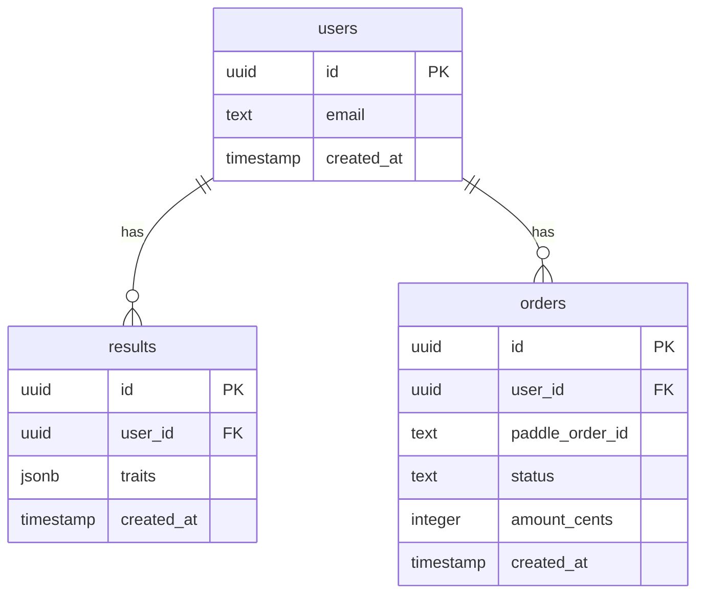

# 09 · Data Model & ERD

```mermaid
erDiagram
  users ||--o{ results : has
  users ||--o{ orders  : has

  users {
    uuid id PK
    text email
    timestamp created_at
  }
  results {
    uuid id PK
    uuid user_id FK
    jsonb traits
    timestamp created_at
  }
  orders {
    uuid id PK
    uuid user_id FK
    text paddle_order_id
    text status
    integer amount_cents
    timestamp created_at
  }
```

## Indexes
- users.email unique
- results.user_id, orders.user_id

## RLS/ACL (if Supabase)
- results: owner read; orders: owner read.
