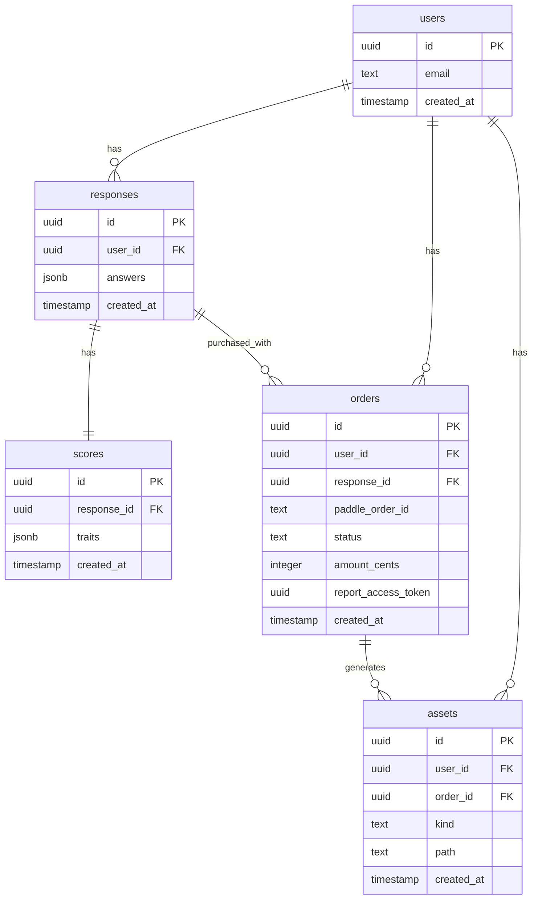

# 09 · Data Model & ERD

## Indexes
- users.email unique
- responses.user_id
- scores.response_id unique
- orders.user_id, orders.response_id, orders.paddle_order_id
- assets.order_id + assets.kind unique (also indexed by user_id and order_id)

## Anonymous user model
- `users.id` is an anonymous UUID stored in a cookie/localStorage (no Supabase Auth).
- `users.email` is optional and only populated for paid orders via the Paddle webhook.
- Access is enforced server-side using the Supabase service role; no RLS policies are assumed.
